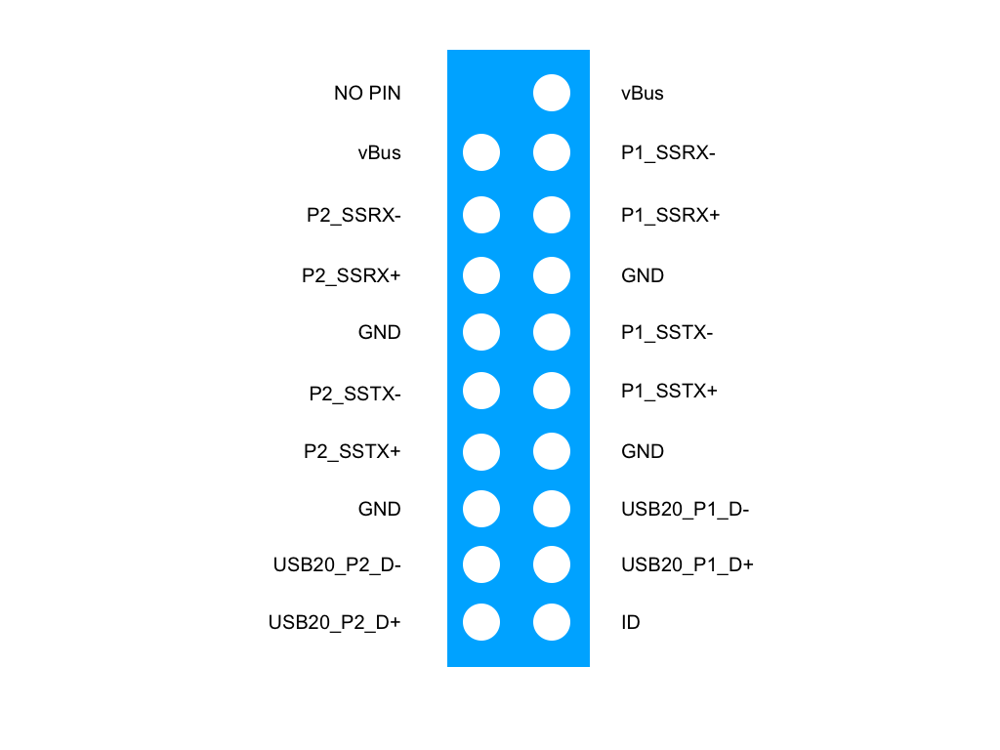

# Installing the LITA Carrier Board

1. The first step is install the JETSON Module with heatsink. 
2. And the peripherals and power supply, the USB OTG is close to the HDMI port:

- POWER SUPPLY
- USB to install Mouse and Keyboard. Here the schematic with the pinout:



- HDMI
- USB OTG
- Ethernet

3. Using UBUNTU 18.04 or higher please install the SDKManager from NVIDIA.
4. Using the SDKManager you can choose the correct module that you are using.
5. For testing purpose you can do all the process to install the operating system and flash to validate that your LITA Carrier board is operative.

We recommend to download the version 4.5.1 currently supported by our drivers.
- Depending of the module you wil be having a folder:

```
/nvidia/nvidia_sdk/JetPack_4.5.1_Linux_JETXON_xxxx/Linux_for_Tegra
```

Where xxx can be:

``` 
JetPack_4.5.1_Linux_JETSON_NANO
JetPack_4.5.1_Linux_JETSON_NANO_DEVKIT
JetPack_4.5.1_Linux_JETSON_XAVIER_NX
JetPack_4.5.1_Linux_JETSON_XAVIER_NX_DEVKIT
JetPack_4.5.1_Linux_JETSON_TX2_NX  
```

6. Please download the support file corresponding to your JETSON Module and put it inside the folder 

```
   /nvidia/nvidia_sdk/JetPack_4.5.1_Linux_JETSON_xxxx/Linux_for_Tegra
```

If you have:

|                                    Hardware                             |                           Firmware                                    |
|-------------------------------------------------------------------------|---------------------------------------------------------------------|
Jetson Nano (developer module) + Camera Sony IMX219 | [Firmware NANO+IMX219](https://github.com/barovehicles/lita-carrier-board/blob/main/firmware/litafirmware_nano.tar.gz)
 Jetson Xavier NX (developer and production module) + Camera Sony IMX219 | [Firmware Xavier+IMX219](https://github.com/barovehicles/lita-carrier-board/blob/main/firmware/litafirmware_xaviernx.tar.gz)| 
Jetson Xavier NX (developer and production module) + Camera VEYE 327 | [Firmware Xavier+Veye327](https://github.com/barovehicles/lita-carrier-board/blob/main/firmware/litafirmware_xaviernx_veye327.tar.gz)|


7. Unzip the file 

``` 
XAVIER NX

IMX219: tar -xvf litafirmware_xaviernx.tar.gz

IMX327: tar -xvf litafirmware_xaviernx_veye327.tar.gz

JETSON NANO

IMX219: tar -xvf litafirmware_nano.tar.gz
```

8. Finally you can Flash the board

| Jetson Xavier NX Production module | sudo ./flash.sh jetson-xavier-nx-devkit-emmc mmcblk0p1 |
|------------------------------------|--------------------------------------------------------|
| Jetson Xavier NX Developer Module  | sudo ./flash.sh jetson-xavier-nx-devkit                |
Jetson NANO Developer SDK |  sudo ./flash.sh jetson-nano-qspi-sd mmcblk0p1 |

