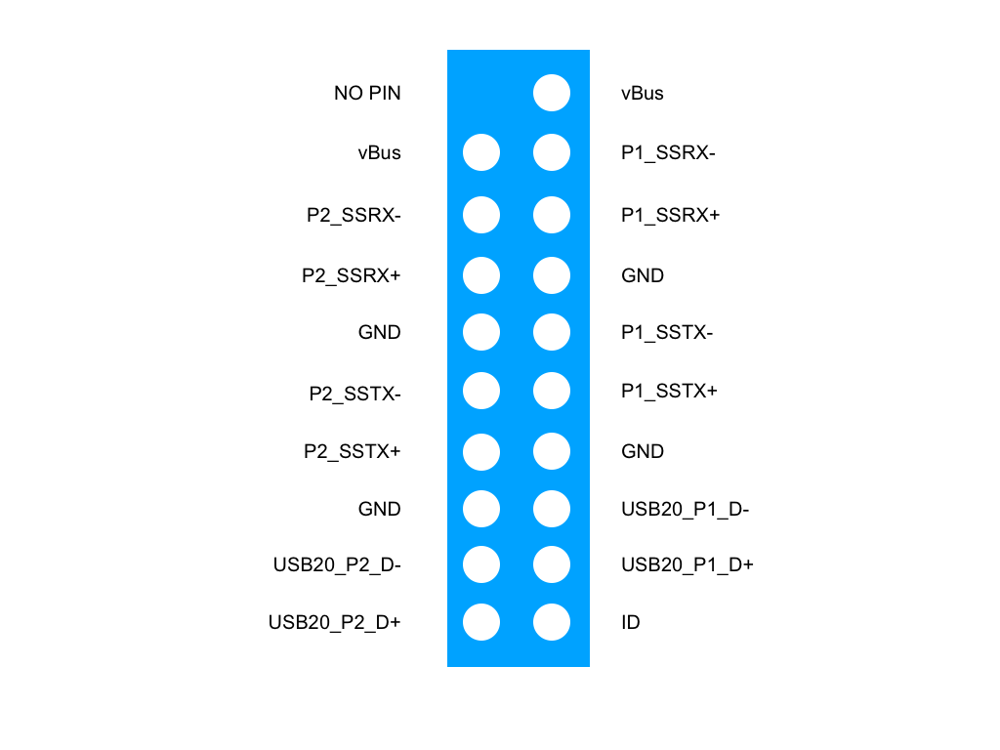

# How to use the peripherals

The LITA Carrier Board was designed to accelerate the process to build a Robot.
Then in this Tutorial you can learn how to use the more important sensors:

a. 4 Cameras MIPI-CSI2
b. GPS
c. IMU

The Carrier board have 4 MIPI CSI-2 cameras connectors ready to use with cameras Compatible with Raspberry PI with a 15 pins connector.
To work correctly is necessary to do the Installation step where the system is updated to:

- Enable the PW_DN PINs used in each camera.
- Update the device tree to understand the configuration using the TCA9548 Multiplexer required to work with only 1 i2C and provide the signal to each camera using the port #70 to switch between then.

After that you can connect the 4 cameras and validated that the cameras are working correctly looking in the /dev folder, where you can find:

/dev/video0
/dev/video1
/dev/video2
/dev/video3

Additionally you can validate that the cameras are running with 

dmesg |  grep imx

'''
   
'''

1. The first step is install the JETSON Module with heatsink. 
2. And the peripherals and power supply, the USB OTG is close to the HDMI port:

- POWER SUPPLY
- USB to install Mouse and Keyboard. Here the schematic with the pinout:



- HDMI
- USB OTG
- Ethernet

3. Using UBUNTU 18.04 or higher please install the SDKManager from NVIDIA.
4. Using the SDKManager you can choose the correct module that you are using.
5. For testing purpose you can do all the process to install the operating system and flash to validate that your LITA Carrier board is operative.

We recommend to download the version 4.5.1 currently supported by our drivers.
- Depending of the module you wil be having a folder:

```
/nvidia/nvidia_sdk/JetPack_4.5.1_Linux_JETXON_xxxx/Linux_for_Tegra
```

Where xxx can be:

``` 
JetPack_4.5.1_Linux_JETSON_NANO
JetPack_4.5.1_Linux_JETSON_NANO_DEVKIT
JetPack_4.5.1_Linux_JETSON_XAVIER_NX
JetPack_4.5.1_Linux_JETSON_XAVIER_NX_DEVKIT
JetPack_4.5.1_Linux_JETSON_TX2_NX  
```

6. Please download the support file corresponding to your JETSON Module and put it inside the folder 

```
   /nvidia/nvidia_sdk/JetPack_4.5.1_Linux_JETSON_xxxx/Linux_for_Tegra
```

If you have:

|Jetson Xavier NX (developer and production module)  | [Firmware Xavier](https://github.com/barovehicles/lita-carrier-board/blob/main/firmware/litafirmware_xaviernx.tar.gz)|
|----------------------------------------------------|------------------------------------------------------------------------------------------|


7. Unzip the file 

```
tar -xvf litafirmware_xaviernx.tar.gz
```

8. Finally you can Flash the board

| Jetson Xavier NX Production module | sudo ./flash.sh jetson-xavier-nx-devkit-emmc mmcblk0p1 |
|------------------------------------|--------------------------------------------------------|
| Jetson Xavier NX Developer Module  | sudo ./flash.sh jetson-xavier-nx-devkit                |
