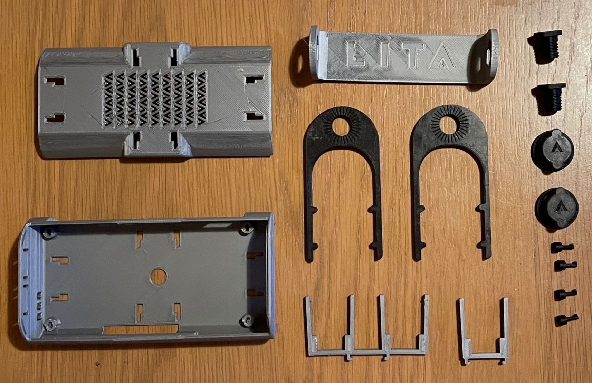

1. We developed a Case to be used with our LITA Carrier Board and facilitate the development using the 4 cameras thinking in several cases of use.

The kit allow to put the Case on the desk. Install the board inside a robot or put the LITA on the Windscreen of your car. With our brackets designed for this purpose.

| Main Case | (https://github.com/barovehicles/lita-carrier-board/blob/main/stl_v292/base_case.stl)
| Cover Case| https://github.com/barovehicles/lita-carrier-board/blob/main/stl_v292/cover_case.stl|

