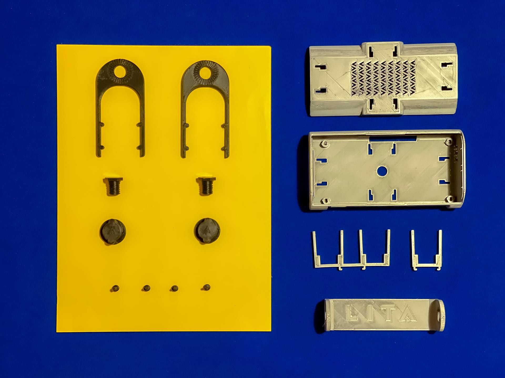
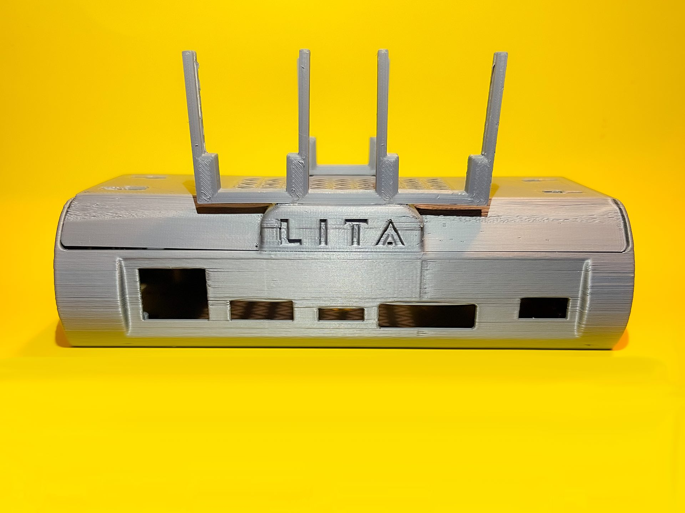
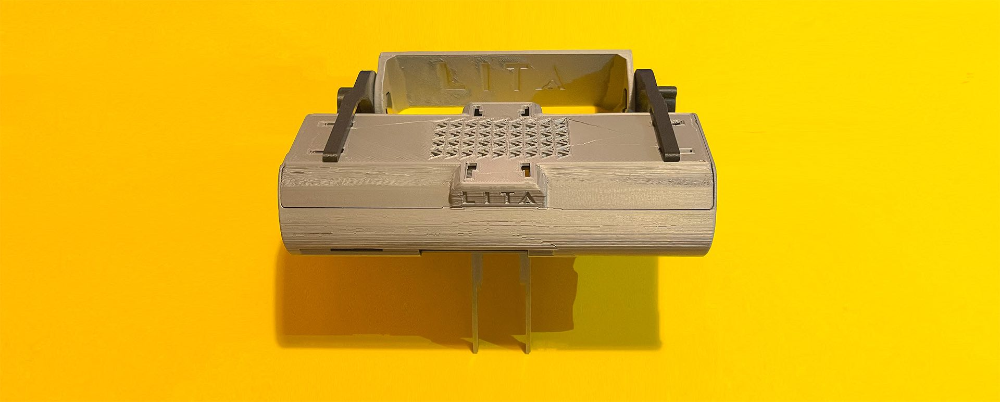

We developed a Case to be used with our LITA Carrier Board and facilitate the development using the 4 cameras thinking in several cases of use.
Our kit allow to use LITA with all your projects related to robotics or computer vision.

The kit allow to put the Case on the desk or fixed to the robot. 

#### Case  

| Part            |         File                         |
|-----------------|--------------------------------------|
| Main Case | (https://github.com/barovehicles/lita-carrier-board/blob/main/stl_v292/base_case.stl)
 Cover Case| (https://github.com/barovehicles/lita-carrier-board/blob/main/stl_v292/cover_case.stl)
 | Bracket to Screw | (https://github.com/barovehicles/lita-carrier-board/blob/main/stl_v292/bracket_to_screw.stl)
 
 #### Camera Holders 

We have the cameras holders to be used with 1 camera or 2 cameras for epipolar vision.

| Part            |         File                         |
|-----------------|--------------------------------------|
 | Cam Holder for 1 camera | (https://github.com/barovehicles/lita-carrier-board/blob/main/stl_v292/cam_holder_1cam.stl)
 | Cam Holder for 2 cameras | (https://github.com/barovehicles/lita-carrier-board/blob/main/stl_v292/cam_holder_2cam.stl)

 #### Car Windscreen Support 

The Kit for the WindScreen is a special bracket to be used with LITA in a Vehicle with windscreen. Then is possible to fix the LITA correctly to do testing with different MIPI cameras.

| Part            |         File                         |
|-----------------|--------------------------------------|
 | Horse Shoe | (https://github.com/barovehicles/lita-carrier-board/blob/main/stl_v292/horseshoe.stl)
 | Windscreen Support |(https://github.com/barovehicles/lita-carrier-board/blob/main/stl_v292/windscree_support.stl)
 | Screw Windscreen | (https://github.com/barovehicles/lita-carrier-board/blob/main/stl_v292/screw_windscreen.stl)
 | Nut Windscreen | (https://github.com/barovehicles/lita-carrier-board/blob/main/stl_v292/nut_windscreen.stl)

